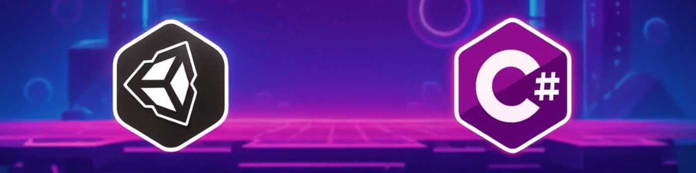

<h1 align="center">Hi there 👋, I'm Mustafa Şükrü YILDIZ</h1> 

  

<h1 align="center">🎮 Mustafa Şükrü Yıldız / DreamBit Games 🎮</h1>

---

## 👤 About Me

- 🎓 Software Engineering background  
- 🎮 Game Developer focused on **Unity & C#**  
- 🧠 Clean code, performance & gameplay systems  
- 🚀 Always improving through real projects  

Currently working on game mechanics, level design, and optimized gameplay systems.

---

## 🧠 Main Languages

  
  

---

## 🛠 Technologies & Tools

- 🎮 **Game Engine:** Unity  
- 💻 **Language:** C#  
- 🔧 **Tools:** Git, GitHub  
- ☁️ **Backend:** Firebase (Basic)  
- 📱 **Mobile:** React Native  

---

## 🎯 Currently Working On

- 🎮 Unity game projects (2D & 3D)
- ⚙️ Gameplay mechanics & AI systems
- 🧩 Puzzle & platformer prototypes
- 📈 Optimization & architecture improvements

---

## 📌 Featured Projects

### 🎮 Maze Rotate
- Unity-based maze puzzle game  
- UI systems & gameplay mechanics  

### 🎮 2D Platformer Game
- Basic enemy AI  
- Level design & UI integration  

👉 Check my repositories for more projects.

---

## 🌱 Goals

- Become a highly skilled **Game Developer**
- Publish polished and original games
- Work on technically strong & creative projects

---

## 🌐 My Socials

   
  &nbsp;&nbsp;&nbsp;
  
 
  &nbsp;&nbsp;&nbsp;

 
  &nbsp;&nbsp;&nbsp;

 

---

> *“Good games are not just played, they are felt.”* 🎯
